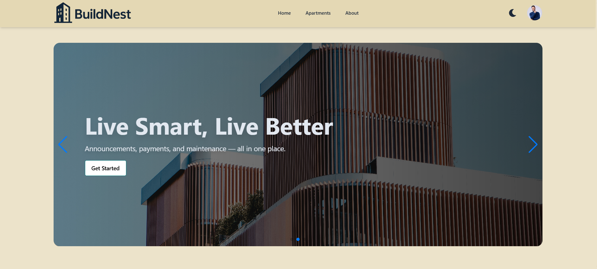
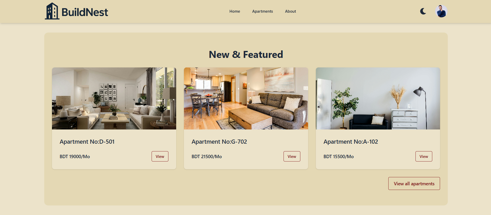
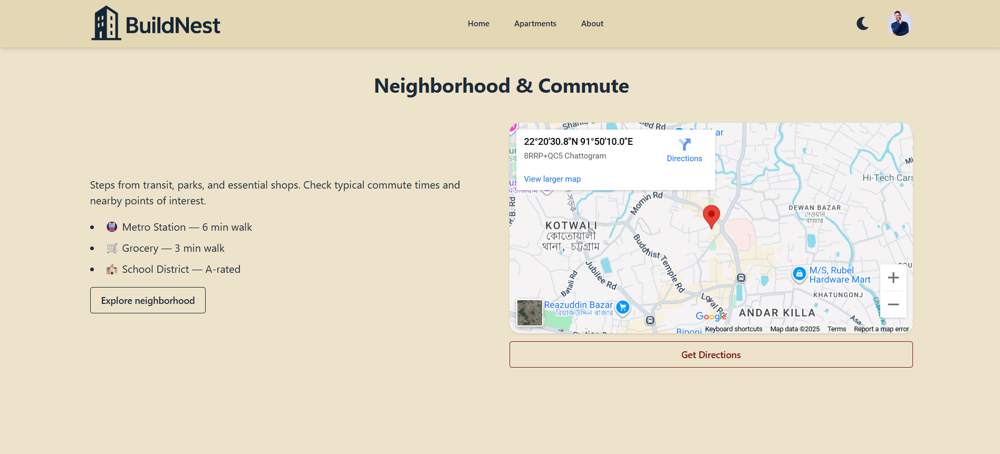
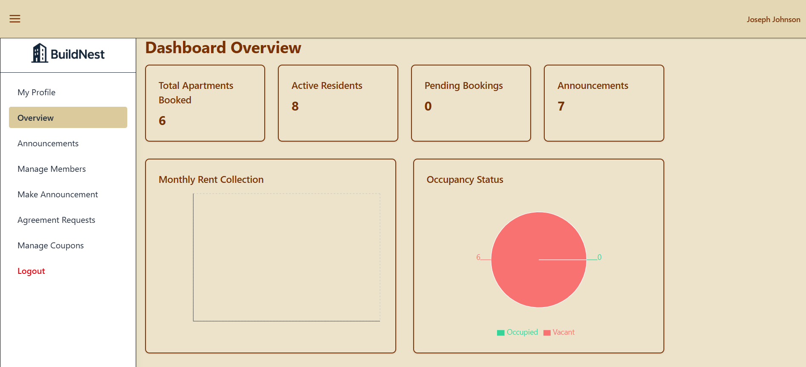
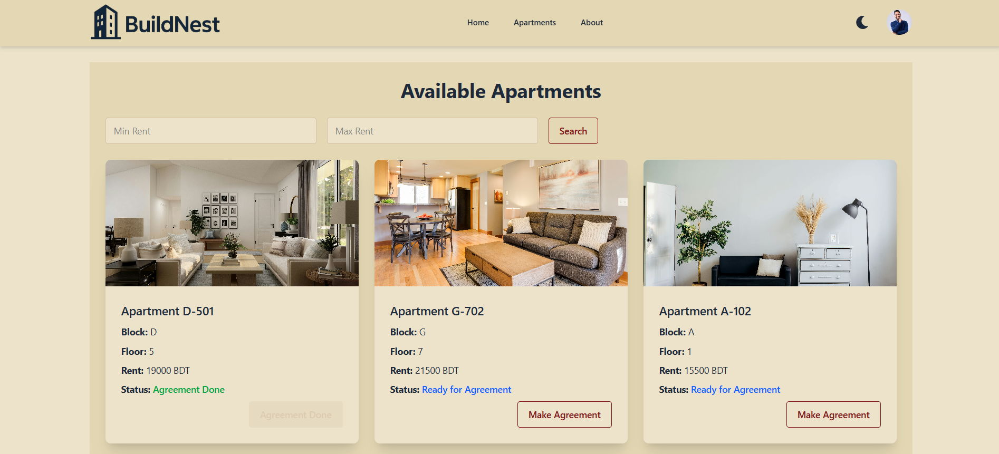
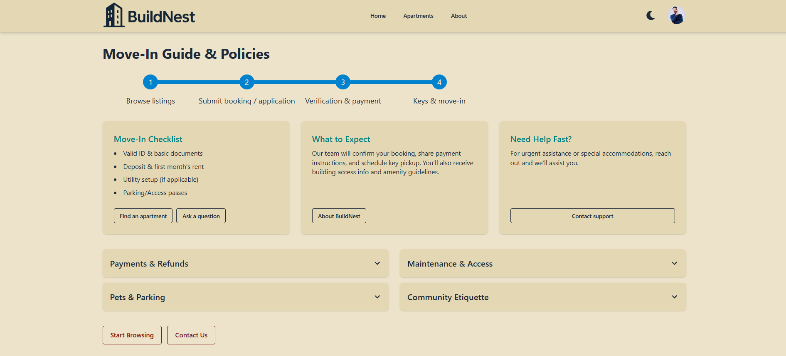
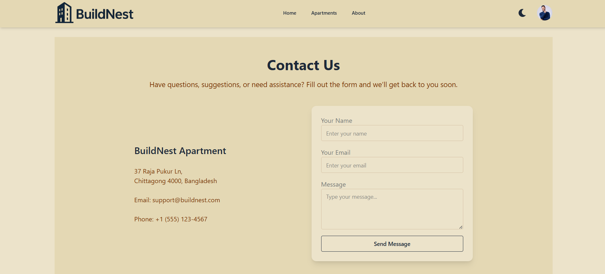
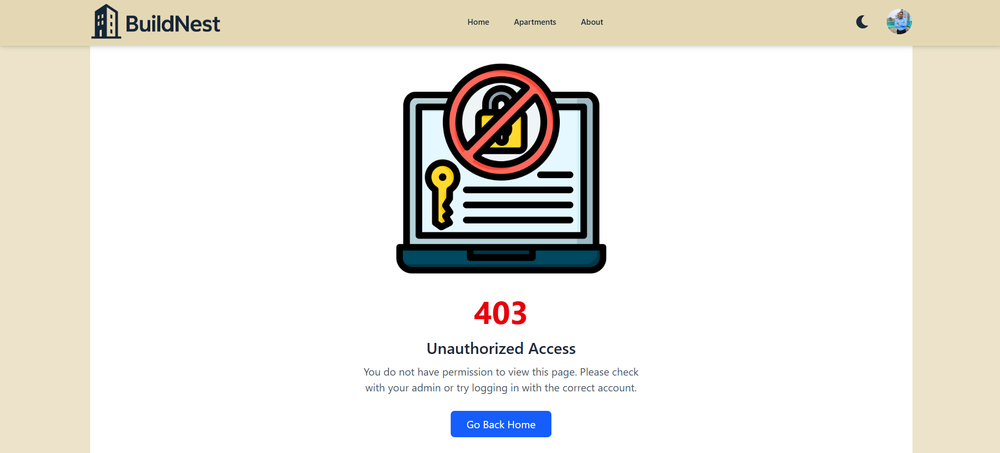
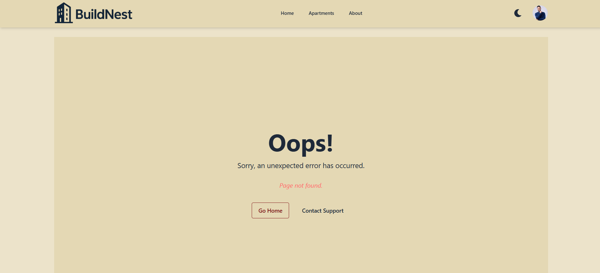

# 🏢 BuildNest

**BuildNest** is a responsive, role-based Building Management System (BMS) built with React, Firebase, and MongoDB.  
It supports authentication, apartment management, resident dashboards, and analytics — all tailored for modern apartment living.

---

## 🌐 Live URL
**[🔗 Live Demo](https://buildnest-d8c3f.web.app)**  

---

## 🎯 Project Purpose
The goal of **BuildNest** is to provide a robust, secure, and user-friendly building management platform where:
- Users can register, log in, and access member dashboards
- Admins can manage apartments, announcements, and members
- Residents can view stats, announcements, payments, and policies
- All operations are synchronized through Firebase Auth + MongoDB backend

---

## 🚀 Key Features

- 🔐 **User Authentication** (Email/Password + Google Sign-in)
- 🧠 **Role-based Access** (`member`, `admin`, etc.)
- 🎨 **Responsive UI** with TailwindCSS + DaisyUI
- 🌙 **Dark/Light Theme Toggle** (Retro ↔ Night, persisted with `localStorage`)
- 🧾 **Coupon Management**
- 📢 **Announcements System** *(private route)*
- 💳 **Payments & Billing**
- 📊 **Dashboard Overview** (stats cards + charts using Recharts)
- 🏡 **Move-In Guide & Policies** section
- 🗺️ **Neighborhood Map** (Google Maps embed)
- 📬 **Contact Page with EmailJS integration**
- ❌ **Error Page** (custom 404 / route error handling)
- ☁️ **Image Upload via ImgBB**
- 📦 **Data Storage using MongoDB Atlas**
- 💬 **Notifications** (React Hot Toast, SweetAlert2)
- 📡 **Server State** with React Query

---

## 🧰 Tech Stack & Packages

### ✅ Frontend
| Package | Purpose |
|--------|---------|
| `react`, `react-dom` | Core frontend |
| `react-router` | SPA routing (public + private routes) |
| `tailwindcss`, `daisyui` | Styling & theming |
| `firebase` | Authentication |
| `axios` | API requests |
| `@tanstack/react-query` | Server state (data fetching, caching) |
| `recharts` | Charts & analytics |
| `react-hot-toast`, `sweetalert2` | Notifications & alerts |
| `react-icons` | Icon library |
| `aos` | Scroll animations |
| `swiper` | Sliders/carousels |
| `@emailjs/browser` | Contact form integration |

### 🛠️ Dev Dependencies
| Package | Purpose |
|--------|---------|
| `vite`, `@vitejs/plugin-react` | Frontend build tool |
| `eslint`, `eslint-plugin-*` | Linting |
| `@types/react`, `@types/react-dom` | Type definitions (if using TS) |

---

## 📁 Folder Structure (simplified)

src/
├── api/ # axiosInstance, saveUser.js
├── components/ # Navbar, Footer, FeaturedApartments, NeighborhoodMap, MoveInGuideSection
├── hooks/ # useOverviewStats, useAuth
├── pages/
│ ├── About.jsx
│ ├── Contact.jsx
│ ├── ErrorPage.jsx
│ ├── Home.jsx
│ ├── Community.jsx # PrivateRoute
│ ├── dashboard/
│ │ ├── Overview.jsx # Charts + stats
│ │ ├── Payments.jsx
│ │ ├── Announcements.jsx
│ │ └── Profile.jsx
├── router/ # router.jsx, RequireAuth.jsx
├── Firebase/ # Firebase config/init
├── styles/ # index.css (DaisyUI theme config)
├── App.jsx
└── main.jsx

---

🗺️ Routing

Public

/ Home

/apartments

/about

/contact

Private

/community (RequireAuth)

/dashboard (index → Overview with charts)

/dashboard/profile

/dashboard/payments

/dashboard/announcements

Error

* → ErrorPage

---

## 📸 Screenshots

### Home Page  

### Featured Section  

### Neighbor & Commute Section  

### Dashboard → Overview (Stats + Charts)  

### Apartments Page  

### Announcements Page  

### Move-In Guide Section  

### Contact Page (EmailJS)  

### Unauthorized Page (404)  

### Error Page (404)  

---

🗺️ Roadmap

 /stats/overview backend aggregation endpoint

 Community → Event/Notice creation

 Full payments analytics

 E2E tests with Playwright/Cypress

🐞 Known Issues

Some pages still import from react-router instead of react-router-dom

Featured apartments fallback slices from all apartments if ?limit=3 not supported on backend

📄 License

MIT © 2025 — BuildNest by Debajit Roy

---